# 🛡️ Лабораторные кейсы по ИБ и администрированию

Здесь собраны графические подтверждения выполнения практических и лабораторных работ.

---

## 🔒 1. СЗИ Secret Net Studio

### Кейс А: Администрирование СЗИ в автономном режиме
*Описание:* Настройка локальных политик безопасности, механизмов разграничения доступа и контроля устройств рабочей станции.

  
<b>🖼️ Нажмите, чтобы посмотреть скриншоты настройки (12 фото)</b>

   

  * 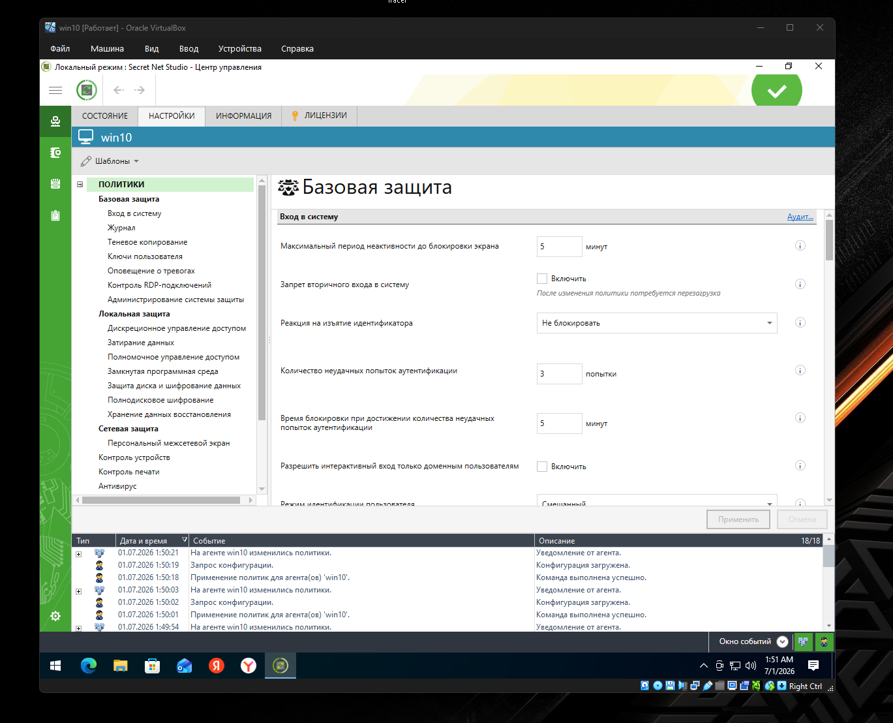
  * 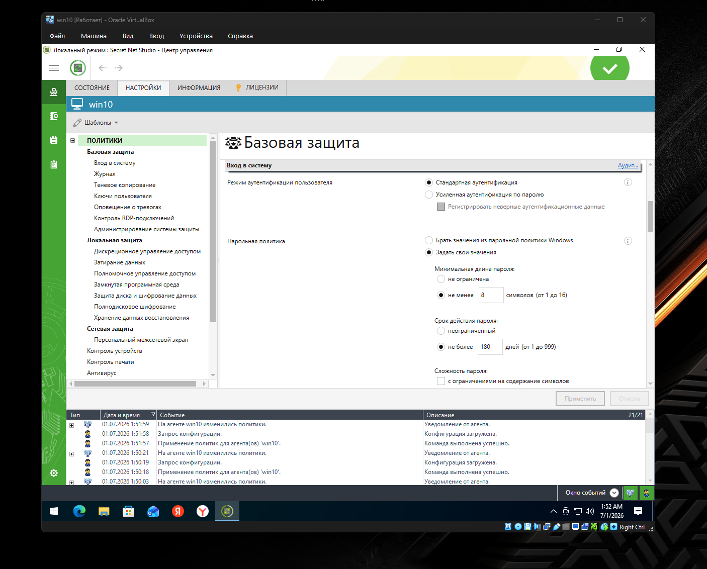
  * 
  * 
  * 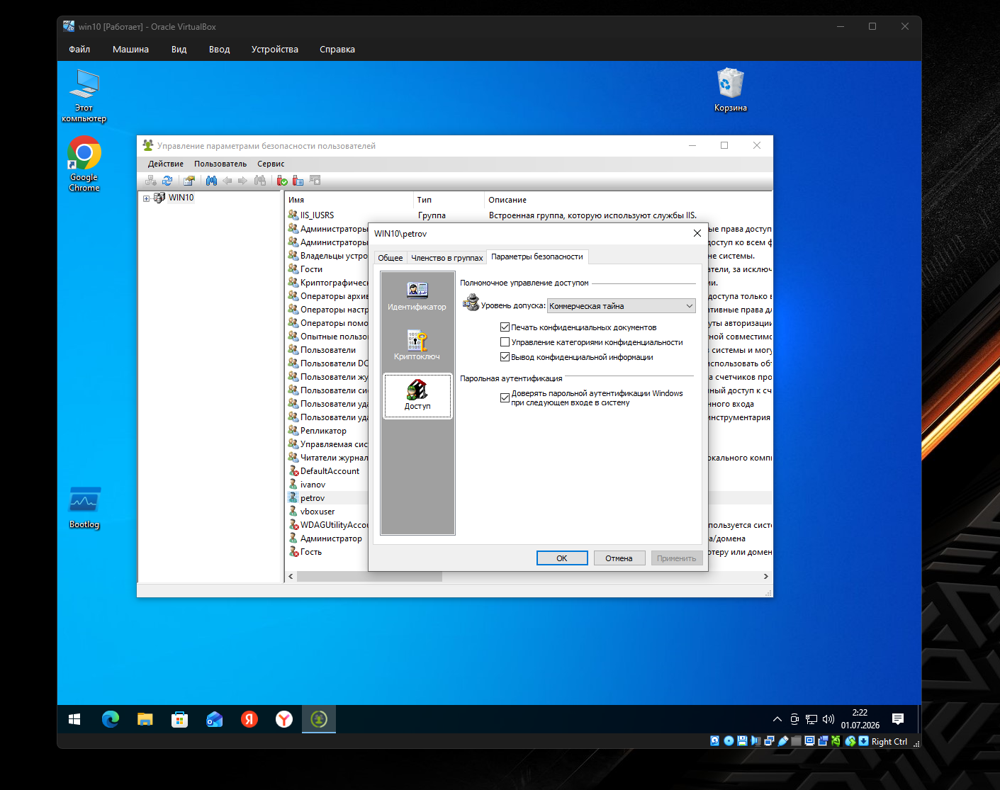
  * 
  * 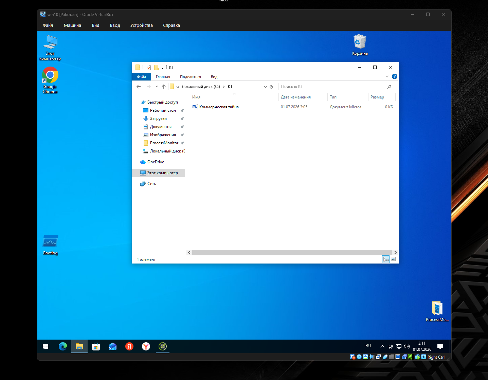
  * 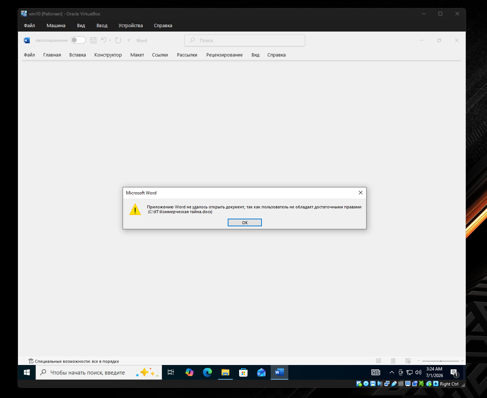
  * 
  * 
  * 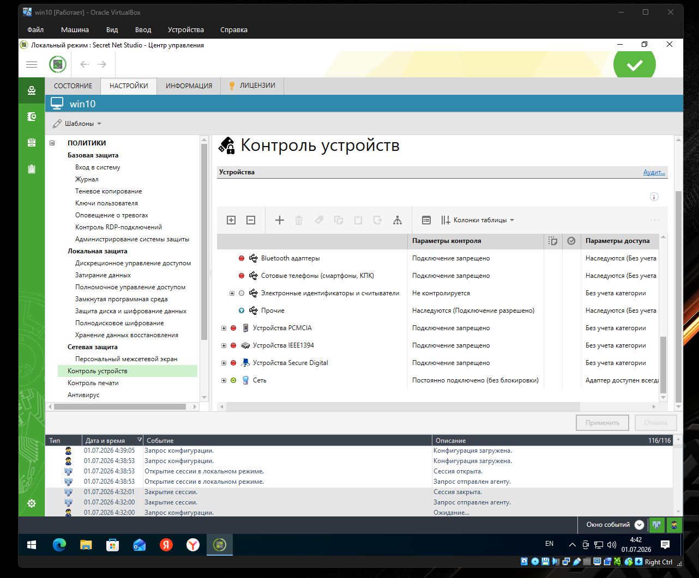
  * 

### Кейс Б: Настройка и администрирование IDS/IPS системы
*Описание:* Развертывание системы обнаружения и предотвращения вторжений, настройка правил фильтрации трафика и сигнатур для защиты сетевого периметра от несанкционированной активности.

  
<b>🖼️ Нажмите, чтобы посмотреть скриншоты настройки IDS/IPS</b>

   

  * 
 

### Кейс В: Расследование инцидента внутренней информационной безопасности
*Описание:* Фиксация и анализ инцидента (факт несанкционированного копирования/кражи конфиденциального файла сотрудника другим пользователем системы) через журнал аудит-безопасности СЗИ.

  
<b>🖼️ Нажмите, чтобы посмотреть скриншоты расследования инцидента</b>

   

  * 
  * 
  * 
  * 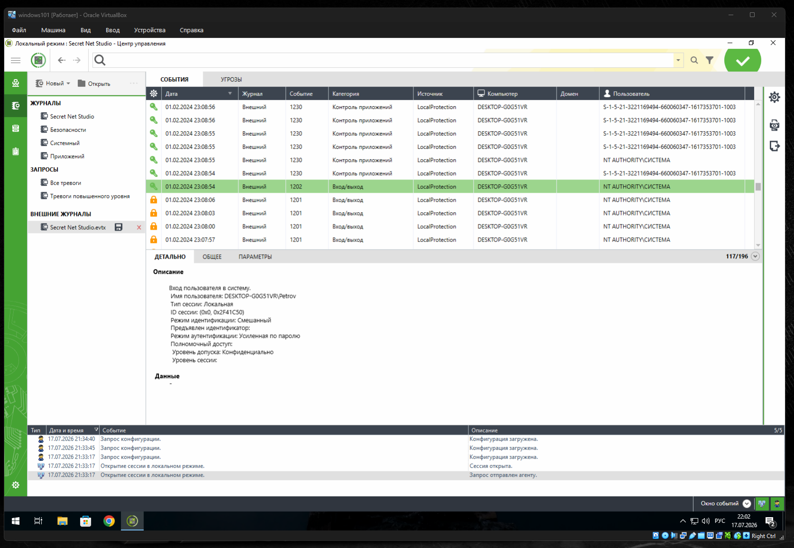
  * 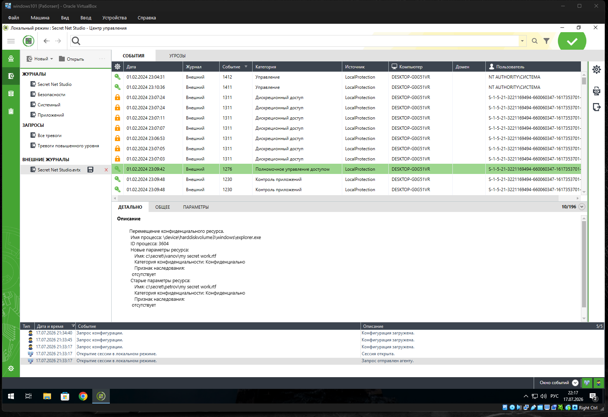
  * 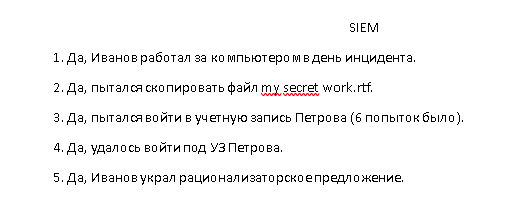

---

## 🦠 2. Kaspersky Security Center

### Кейс А: Централизованное администрирование антивирусной защиты
*Описание:* Развертывание и настройка серверов администрирования, создание и применение групповых политик безопасности и правил обновлений для хостов корпоративной сети.

  
<b>🖼️ Нажмите, чтобы посмотреть скриншоты настройки Kaspersky Security Center</b>

   

  * 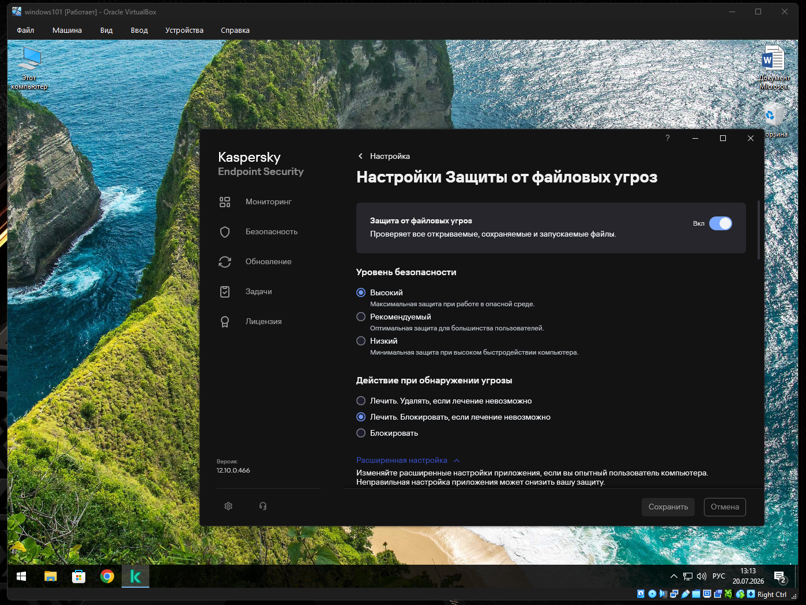
  * 
  * 
  * 
  * 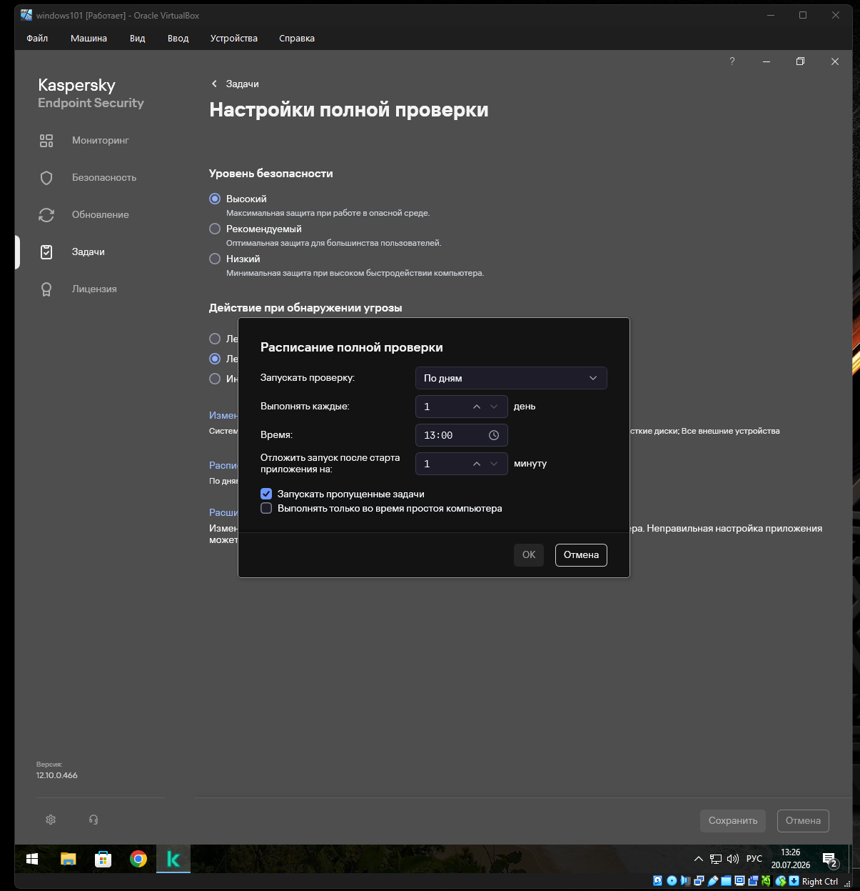
  * 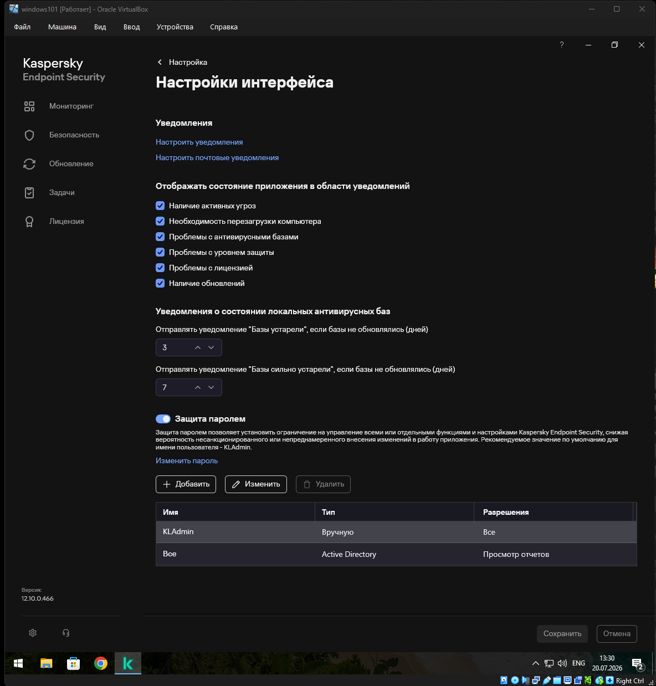
  * 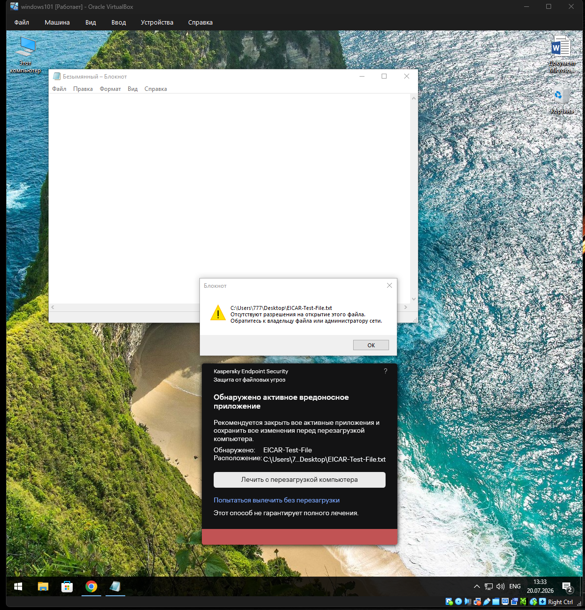
  

